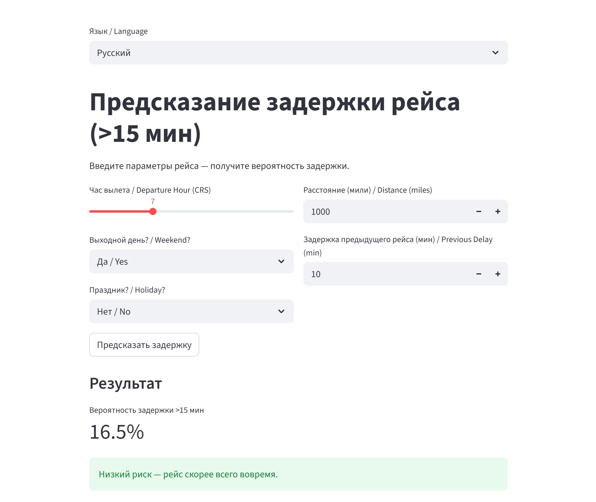

# Flight Delay Prediction (December 2024) / Предсказание задержек рейсов (декабрь 2024)

[](https://www.python.org/)
[](https://streamlit.io/)
[](https://xgboost.readthedocs.io/)

**English** | [Русский](#русский-вариант)

This project is the final assignment for the Data Science course at Skill Factory.  
Goal: build a model to predict flight delay probability (>15 minutes) using BTS data for December 2024, with focus on time of day, weekends, holidays, and aircraft chain delays.

### Key Results
- **Model ROC-AUC**: 0.766 (5-fold TimeSeries CV)
- **Top predictors**:
  - Morning flights almost never delayed (IsMorning — strongest feature)
  - Previous aircraft delay (PreviousDepDelay) — second most important
  - Evening peak and weekends significantly increase risk
- Weather/snow has minor influence (historical NOAA norms show no significant correlation)

### Project Structure
#### flight-delays-project/
#### ├── delays_ru.ipynb          ← Russian notebook (full analysis + model)
#### ├── delays_en.ipynb          ← English version
#### ├── demo_streamlit.py        ← Interactive demo application
#### ├── requirements.txt         ← Dependencies
#### ├── README.md                ← This file
#### └── screenshots/             ← Demo and graph screenshots


### How to Run

#### 1. Install dependencies
```bash
pip install -r requirements.txt
```

#### 2. View notebooks

- Russian notebook:  
  [delays_ru.ipynb](delays_ru.ipynb)

- English notebook:  
  [delays_en.ipynb](delays_en.ipynb)

#### 3. Run the demo application (Streamlit)
- [demo_streamlit.py](demo_streamlit.py)  
  **Live demo:** [Open demo](https://flightdelaymichaelsdemo.streamlit.app/)

#### Live Demo
Screenshots:
**English interface**  


#### Aviation Business Insights

Airlines (Delta, Southwest, American): Add 15–20 min buffers for evening/weekend flights in December.
Airports (ATL, ORD, DFW): Prioritize resources for high-traffic hubs (DFW, EWR, MIA).
Potential savings: Delays cost $33B/year in the US — 5–10% reduction via predictions = $1.65–3.3B.

#### Limitations

AUC 0.766 — solid for clean BTS data, but not production-level (0.85+).
No real-time external data (hourly weather, inbound flight status, ATC loads).
Single month — seasonal bias.

#### Future Improvements

Integrate NOAA hourly weather API
Extend PreviousDepDelay across multiple days
Stacking or DL (LSTM) for +0.05 AUC
Deploy to Streamlit Cloud (public link)

This project demonstrates a complete DS workflow: from data cleaning to interactive demo.
Ready for portfolio or as a prototype for aviation analytics.


# Предсказание задержек рейсов в США (декабрь 2024) / US Flight Delay Prediction (Dec 2024)

[](https://www.python.org/)
[](https://streamlit.io/)
[](https://xgboost.readthedocs.io/)

**Русский** | [English](#english-version)

Этот проект — финальная работа курса Data Science в Skill Factory.  
Цель: построить модель для предсказания задержки рейса (>15 минут) на данных BTS за декабрь 2024, с акцентом на время суток, выходные, праздники и цепные задержки самолётов.

### Ключевые результаты
- **ROC-AUC модели**: 0.766 (TimeSeries CV, 5 фолдов)
- **Главные факторы задержек**:
  - Утренние рейсы почти никогда не задерживаются (IsMorning — самый сильный признак)
  - Задержка предыдущего рейса самолёта (PreviousDepDelay) — второй по важности
  - Вечерний пик и выходные значительно увеличивают риск
- Погода/снег — слабый фактор (исторические нормы NOAA не дали значимой корреляции)

### Структура проекта
#### flight-delays-project/
#### ├── delays_ru.ipynb          ← русский ноутбук (полный анализ + модель)
#### ├── delays_en.ipynb          ← английская версия
#### ├── demo_streamlit.py        ← интерактивное демо-приложение
#### ├── requirements.txt         ← зависимости
#### ├── README.md                ← этот файл
#### └── screenshots/             ← скриншоты демо и графиков

### Как запустить

#### 1. Установка зависимостей
```bash
pip install -r requirements.txt
```

#### 2. Просмотр ноутбуков

- Русский ноутбук:  
  [delays_ru.ipynb](delays_ru.ipynb)

- Английский ноутбук:  
  [delays_en.ipynb](delays_en.ipynb)

#### 3. Запуск демо-приложения (Streamlit)
- [demo_streamlit.py](demo_streamlit.py)  
  **Онлайн-версия:** [Открыть демо](https://flightdelaymichaelsdemo.streamlit.app/)

### Демо-приложение на Streamlit

**Русский интерфейс**  


**Как запустить:**
```bash
streamlit run demo_streamlit.py

#### Ключевые инсайты для авиации

Авиакомпаниям: Добавляйте буферы 15–20 минут для вечерних и выходных рейсов в декабре.
Аэропортам: Приоритизируйте ресурсы для хабов с высоким трафиком (DFW, EWR, MIA).
Потенциальная экономия: Задержки стоят отрасли $33 млрд/год в США — 5–10% снижение через прогнозы = $1.65–3.3 млрд.

#### Ограничения

AUC 0.766 — хороший результат для чистых BTS-данных, но не продакшен-уровень (0.85+).
Нет реал-тайм погоды, статуса входящих рейсов и загрузки воздушного пространства.
Один месяц данных — возможен сезонный bias.

#### Будущие улучшения

Интеграция API NOAA для погоды по часам
Расширение PreviousDepDelay на несколько дней
Стэкинг моделей или DL (LSTM) для +0.05 AUC
Развёртывание на Streamlit Cloud (публичная ссылка)

Проект демонстрирует полный цикл DS: от очистки данных до интерактивного демо.
Готов к использованию в портфолио или как прототип для авиационной аналитики.