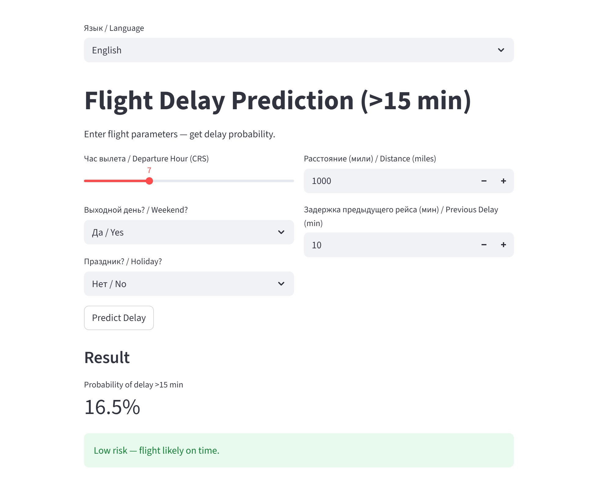

# Flight Delay Prediction (December 2024) / Предсказание задержек рейсов (декабрь 2024)

[](https://www.python.org/)
[](https://streamlit.io/)
[](https://xgboost.readthedocs.io/)

**English** | [Русский (README_ru.md)](README_ru.md)

This project is the final assignment for the Data Science course at Skill Factory.  
Goal: build a model to predict flight delay probability (>15 minutes) using BTS data for December 2024, with focus on time of day, weekends, holidays, and aircraft chain delays.

### Key Results
- **Model ROC-AUC**: 0.766 (5-fold TimeSeries CV)
- **Top predictors**:
  - Morning flights almost never delayed (IsMorning — strongest feature)
  - Previous aircraft delay (PreviousDepDelay) — second most important
  - Evening peak and weekends significantly increase risk
- Weather/snow has minor influence (historical NOAA norms show no significant correlation)

### Project Structure
#### flight-delays-project/
#### ├── delays_ru.ipynb          ← Russian notebook (full analysis + model)
#### ├── delays_en.ipynb          ← English version
#### ├── demo_streamlit.py        ← Interactive demo application
#### ├── requirements.txt         ← Dependencies
#### ├── README_en.md             ← This file
#### ├── README_ru.md             ← Russian version of README
#### └── screenshots/             ← Demo and graph screenshots


### How to Run

#### 1. Install dependencies
```bash
pip install -r requirements.txt
```

#### 2. View notebooks

- Russian notebook:  
  [delays_ru.ipynb](delays_ru.ipynb)

- English notebook:  
  [delays_en.ipynb](delays_en.ipynb)

#### 3. Run the demo application (Streamlit)
- [demo_streamlit.py](demo_streamlit.py)  
  **Live demo:** [Open demo](https://flightdelaymichaelsdemo.streamlit.app/)

#### Live Demo
Screenshots:
**English interface**  


#### Aviation Business Insights

Airlines (Delta, Southwest, American): Add 15–20 min buffers for evening/weekend flights in December.
Airports (ATL, ORD, DFW): Prioritize resources for high-traffic hubs (DFW, EWR, MIA).
Potential savings: Delays cost $33B/year in the US — 5–10% reduction via predictions = $1.65–3.3B.

#### Limitations

AUC 0.766 — solid for clean BTS data, but not production-level (0.85+).
No real-time external data (hourly weather, inbound flight status, ATC loads).
Single month — seasonal bias.

#### Future Improvements

Integrate NOAA hourly weather API
Extend PreviousDepDelay across multiple days
Stacking or DL (LSTM) for +0.05 AUC
Deploy to Streamlit Cloud (public link)

This project demonstrates a complete DS workflow: from data cleaning to interactive demo.
Ready for portfolio or as a prototype for aviation analytics.


